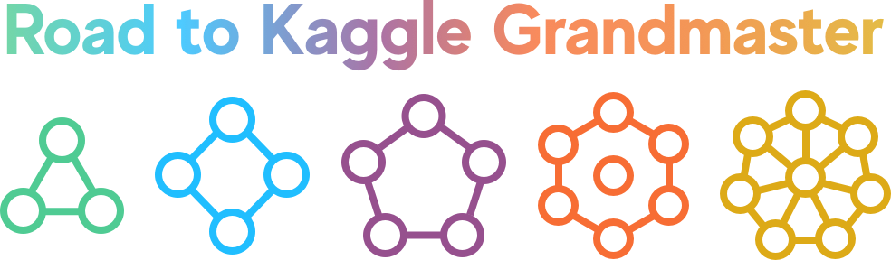

<p align="center">
  
  <br/>
  
  <p align="center">🥇Add dynamically generated Kaggle Tier & Medals on your readme.🥇</p>
  
</p>

<p align="center">
  
  
  
  
</p>

[](https://hits.seeyoufarm.com)

## Usage & Example

Like any other Github badge, you can add it to your profile with a code.

To use badges, edit the following code and copy-paste it. 

If you forgot your ID, you can go to your profile and check the string at the end of the url.

### Competition

```


```


### Dataset

```


```


### Notebook

```


```


### Discussion

```


```


## License

Original design licenses for tiers, medals and colors are all owned by Kaggle.

## ETC

> Official website and more cool designs will be added.